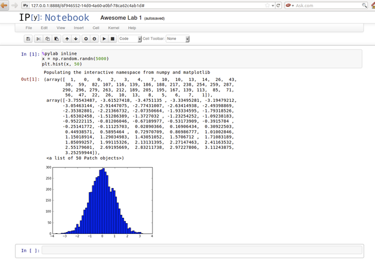

#Setting Up Your Environment

In this class, we will all be using the same Virtual Machines to complete assignments and class exercises. We have configured a Virtual Machine Image with a recent version of Linux, Python 2.7, and several libraries we’ll be using throughout the class. 

*Note: While you should also be able to set up a similar environment on your Mac or PC without needing a Virtual Machine, the course staff will not support such configurations - so you’re on your own if you choose to go that route!*

Follow the instructions [available here](http://beta.saasbook.info/bookware-vm-instructions) to install VirtualBox, and the virtual machine image. The virtual machine image already includes most of the software necessary to run the code. We will install extra packages below.

*Note: After opening a terminal on the VM, if the language is incorrect, run sudo dpkg-reconfigure keyboard-configuration and choose English(US).*

Follow these instructions to configure python and some data-related packages.

1. Start up the machine. Enter 'saasbook' as the password.
2. Launch a terminal. (Third icon in the launcher on the left.)
3. Run: `git clone https://github.com/amplab/datascience-sp14.git`
4. Run: `sudo bash datascience-sp14/setup/setup.bash`
    * You’ll need to enter “saasbook” as the password.
5. Grab a coffee or something - it will take a few minutes to build/install these components.
    * Also if you see warnings etc. on the screen, don’t worry that is expected.

To test that your machine is set up properly, run the following from a terminal window:

1. `ipython notebook`
2. In the browser window that pops up, create a new notebook, and enter the following in the first cell:

		%pylab inline
		x = np.random.randn(5000)
		plt.hist(x, 50)
3. Hit the 'Play' button on the toolbar.
4. You should end up with something like this:

5. Close firefox, hit Control-C and Y to exit.